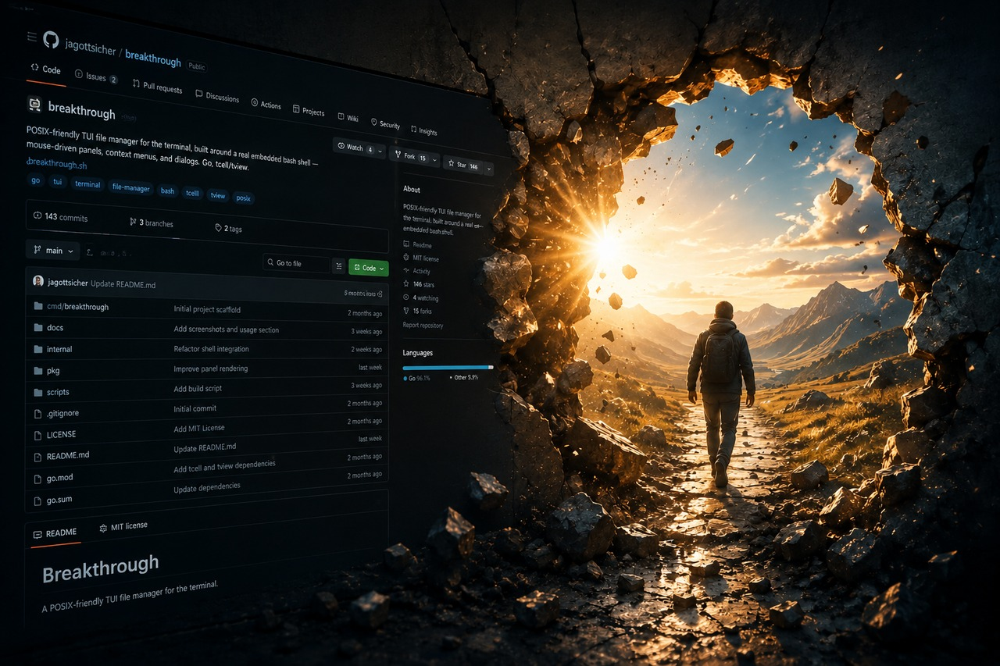

[](https://opensource.org/licenses/Apache-2.0) [](https://github.com/jagottsicher/breakthrough/actions/workflows/test-linux.yml)
[](https://github.com/jagottsicher/breakthrough/actions/workflows/test-linux-arm.yml)
[](https://github.com/jagottsicher/breakthrough/actions/workflows/test-macos.yml)

# breakthrough
## A mouse-and-menu-driven TUI file manager for your POSIX-compliant terminal, built around a real embedded bash shell — written in Go.



breakthrough puts classic GUI file-manager idioms — a browsable panel,
context menus, floating dialogs, clickable breadcrumbs — over a real bash
session, without ever leaving the shell. It's built with
[tcell](https://github.com/gdamore/tcell) and
[tview](https://github.com/rivo/tview); it is not integrated into Bash
itself — no fork, no patch, no hook into Bash's own internals. Its console
is a first-class citizen all the same: its own history, path completion
against the current directory, multi-line scripting, and every command
running through your actual `$SHELL`, started the same way an
interactive login shell would be — so it sources that shell's own
startup files and expands its aliases, whichever shell that actually is
— not a reimplementation of one.

It is explicitly not an attempt to rebuild Midnight Commander — the goal is
its own UX philosophy, closer to classic GUI file managers, just in the
terminal.

## Features

- Panel-based directory browsing: arrow-key and mouse navigation, a
  clickable path breadcrumb bar with Start/Home/Back/Forward — its
  history covers a trip into search results or the trash exactly the
  same as a real directory, and Back/Forward into any of them restores
  the cursor row it was left on, a search's own results included, shown
  again exactly as they were rather than a live re-run — sortable
  Name/Size/Modified columns, and file-type indicators (directory,
  symlink — including broken and multi-hop chains, socket, FIFO, device,
  mount point, hard link) matching Midnight Commander's own glyph scheme.
  Every entry Enter can navigate into — a directory, a symlink to one, a
  mount point, or `..` itself — gets its own name highlighted dark
  yellow (just the name, not the trailing `/` or a symlink's `-> target`
  arrow), so folders stand out from plain files at a glance. Beyond
  that, a name's own text color also tells them apart: green for
  executable, red for a broken symlink, a darker red for anything the
  current user can't actually read (checked with a real permission
  check, not just Mode's bits — a `/proc` entry included), cyan for a
  working symlink to a file, orange for a socket/FIFO/device, magenta
  for a recognized archive extension, and a dim gray for a dotfile/
  dotdir (unless one of the other cases above already applies).
- A live filter, right in the top row: type to narrow the listing on
  every keystroke, with a Glob/Regex toggle for how the pattern is
  interpreted.
- A right-click context menu: Properties (editable — name, permissions,
  click a bit or type the octal value directly, owner and group via a
  scrollable picker of every local user/group, modified date and time),
  Edit, Look, Tail -f, Rename, checkbox-based multi-selection (including
  glob-pattern Select +/-), Copy/Cut/Paste, chmod, chown, Sed Replace,
  and the trash actions below.
- Move to Trash / Remove: `^T` or Entf moves the current selection to
  your own trash — recursively for a directory, no confirmation, since
  that's the reversible action by design. `^R`, Ctrl+Entf (best-effort —
  terminal-dependent; `^R` is always the reliable one), or the context
  menu's "Remove" permanently deletes instead (a file like `rm`, a
  directory recursively like `rm -rf`, empty or not), always behind a
  confirmation dialog with Cancel preselected — a single stray keypress
  can never confirm it by itself. "Go to Trash" (`^B`, or "Trashbin" in
  the button bar) jumps straight into it without needing to know its
  path; "Restore from Trash" and "Empty Trash" (same confirmation) round
  it out. Persistent by default — lives under
  `~/.local/share/breakthrough/trash`, so it's still there tomorrow, even
  across a login session boundary — or session-scoped via
  `trash_persistent = false` in your config, under `$XDG_RUNTIME_DIR`
  instead, gone once the session ends; running as root (e.g. via `sudo`)
  always gets the persistent path regardless, since root has no real
  session of its own for a session-scoped trash to mean anything for.
  Kept from growing forever by two settings checked once at startup, not
  on every single trash operation: `trash_max_age_days` (30 by default —
  anything older is removed unconditionally) and `trash_quota_percent`
  (10 by default — a backstop, oldest item first, only if age alone
  didn't already bring the trash back under that share of the
  filesystem it lives on); either one is `0` to disable it. Anything
  actually removed this way is reported once, on the next start.
  Browsing the trash itself ("Go to Trash"/Trashbin) shows each item's
  own original path in place of its real on-disk name (a collision-
  avoidance hash you'd otherwise have to squint past — two files
  trashed from the very same location, more than once, still stay
  distinguishable this way) and labels the Modified column "Deletion
  time" instead — both, like the Modified column always has, respecting
  the Options overlay's timestamp-vs-formatted toggle and the column's
  own sort.
- Sed Replace (`^S`, or the context menu): runs a real `sed(1)`
  substitution against the current selection — one file or several, not
  a directory tree. A guided Find/Replace pair (Regex, Extended regex
  `-E`, Case-insensitive, and Replace-all-per-line toggles) builds the
  script for you, or drop straight into the advanced field and write the
  sed script yourself for anything real sed can do — address ranges,
  multiple commands, backreferences. Always previews first, as a
  Name/Line/Excerpt table — one row per changed line, skipped files
  listed with why — computed in the background with a live "Checking N
  of M" status; only Apply, behind the same Cancel-preselected
  confirmation, actually writes, optionally keeping a `.bak` of each
  original first. Never uses sed's own `-i`: GNU and BSD/macOS sed take
  incompatible arguments for it, so this always runs sed as a plain
  filter and writes the result back itself.
- Three rows below the panel, each with its own job. First, a real
  shell command line (with its own history — shared with `$HISTFILE` if
  you've set it, `~/.bash_history` otherwise regardless of your actual
  shell, a deliberate choice so this line's own history always behaves
  like a bash one's — and `cd` handled directly rather than uselessly
  changing a subshell's own directory), which expands when clicked
  into — full width, no prompt, growing upward toward mid-screen with a
  "Bash Prompt Editor" legend above it — for
  multi-line bash scripting (Enter runs the buffer, Ctrl+J or Alt+Enter
  inserts a newline instead — Ctrl+J always works, Alt+Enter is
  intercepted by some terminal emulators for their own use; Up/Down
  recall history too, not just Ctrl+P/Ctrl+N, except at a line a
  multi-line script is still being composed on; Tab completes the
  filename/directory at the cursor against the panel's own current
  directory, or, when several matches agree on nothing further, opens a
  scrollable pick list of them instead of doing nothing). Every command
  runs through your actual `$SHELL`, started the same way an
  interactive login shell would be — that shell's own startup files,
  aliases and functions sourced first, so something like `ll` works
  exactly as it does in a real terminal — the same way Midnight
  Commander's own command line handles every command — no attempt to
  guess which programs need one and which don't. Its own output stays on
  screen until you press Escape to return, so it doesn't just flash by.
- A middle row of nano-style quick-action buttons, always visible right
  below the command line, in a fixed order: Help (`F1`), Rename (`F2` —
  the same key most GUI file managers use for it), Edit (`^E`, opens
  `$VISUAL`/`$EDITOR`, or
  [`select-editor(1)`](https://manpages.debian.org/testing/sensible-utils/select-editor.1.en.html)'s
  own pick if set, on the selected file), Look (`^L`, see below),
  Properties (`^P`), Search (`^F`, see below), Sed Replace (`^S`),
  toggle hidden files (`^G` — labeled Hide or Unhide, whichever it would
  do next, not whichever state you're currently in), Options (`^O`),
  Move to Trash (`^T`), Trashbin (`^B`, jumps straight into your own
  trash without needing to know its path), and Remove (`^R`). Two of
  these change with where you are: Trash disappears and Trashbin turns
  into Restore while you're actually browsing the trash itself — moving
  something already in the trash to the trash again doesn't mean
  anything, so `^T`/Entf there does a Remove instead, with the exact
  same confirmation any other Remove has. Each button is also reachable
  from the context menu, and each still works the same way whichever
  panel or field currently has focus, except while the command line
  itself is expanded and needs those same keys for its own editing.
  Hidden-files/size-format/mtime-format toggles are remembered across
  restarts.
- A bottom row that's purely informational, no buttons on it at all: the
  current user, disk and inode usage for the directory on screen, the
  running kernel (`uname -r`), uptime and load average where the
  platform exposes them (Linux's own `/proc/uptime` and
  `/proc/loadavg` — quietly omitted elsewhere rather than shown wrong),
  and a clock.
- Color schemes: JSON files under `colorschemes/` in either config tier
  (see below), switchable live from the Settings overlay (`^X` or the
  bottom bar's own button) — no restart needed, and the pick is
  remembered for next time.
- Search (`^F`, or the bottom bar's own button): by file name (glob, a
  plain keyword, or regex — via `find`, or `locate` where its own index
  is available) or by file content (`grep`, and — where installed —
  `zgrep`/`zipgrep` for gzip/zip contents), scoped to any directory,
  with real-time streamed results you can jump straight to. Runs the
  real system tools rather than a reimplemented search, so it inherits
  whatever's already indexed by `locate`'s own `updatedb`. The results
  view isn't a dead end either: its own header carries a real,
  fully clickable/editable path breadcrumb — starting at the search's
  own scope — right alongside the status line, so you can keep
  browsing normally without first jumping to a specific hit or backing
  all the way out with Escape.
- Look (`^L`, the bottom bar's own button, or the context menu): a
  read-only, full-screen preview of the selected file's content.
  Plain text, source code, config files, diffs/patches, and logs get
  built-in syntax coloring (~200 languages, no external dependency —
  large files show their own first 8 MiB rather than being fully
  loaded). PNG, JPEG, GIF, BMP, TIFF, and WebP images render right in
  the terminal — decoded and scaled entirely in Go, no external tool
  needed there either. A format Look doesn't have a decoder for at all
  (HEIC, AVIF, RAW, ...) still opens the same overlay, with a
  recommendation for an external tool that can (`chafa`, or `pixterm`
  if you'd rather stick to Go-only tooling) — matched to whichever
  package manager your system actually has. Set `pager = external` in
  your config instead (see [Color schemes](#color-schemes) below for
  the file itself) to open `bat`/`batcat`, `$PAGER`, or `less`/`more`
  in your real terminal for text. "Tail -f", right next to Look in the
  context menu, follows a growing log live via the real `tail -f`.
  PDFs open page by page — as a real rendered page image where
  [poppler-utils](https://poppler.freedesktop.org/)'s `pdftoppm` is
  installed (feeding straight into the same image renderer above), or
  as extracted plain text otherwise, entirely in Go, no external tool
  required. `PageUp`/`PageDown` move between pages either way; `g`/`t`
  switch a given page between rendered-image and extracted-text view
  on demand — handy since a text-heavy page rendered as an image
  downsamples into illegible mush at any realistic terminal size.

## Status

Actively developed. The single-panel core above is functional and
tested, trash and Sed Replace included; a second panel and the rest of
the settings layer beyond color schemes and the trash toggle are
planned next — see
[docs/whitepaper.md](docs/whitepaper.md) for the full concept and
vision, and follow along or join in on
[Discussions](https://github.com/jagottsicher/breakthrough/discussions).

## Color schemes

breakthrough ships with one built-in scheme ("Default") and reads
further ones from `colorschemes/*.json` in either config tier —
`/etc/breakthrough/colorschemes/` for system-wide schemes,
`~/.config/breakthrough/colorschemes/` (or `$XDG_CONFIG_HOME/breakthrough/colorschemes/`
if set) for your own; a user file with the same name replaces a system
one. Switch between whatever's found via the Settings overlay (`^X`, or
its button in the bottom bar) — the pick applies immediately and is
saved to your own `~/.config/breakthrough/config`.

Two ready-made examples ship in [`examples/colorschemes/`](examples/colorschemes/)
— a dark Solarized-based scheme and a light one:

```sh
mkdir -p ~/.config/breakthrough/colorschemes
cp examples/colorschemes/*.json ~/.config/breakthrough/colorschemes/
```

A scheme file only needs to set the fields it actually wants to change —
anything left out falls back to the Default scheme's own value. Each
color is either a `#rrggbb` hex value or a
[W3C color name](https://pkg.go.dev/github.com/gdamore/tcell/v2#pkg-variables)
(e.g. `"darkslategray"`). See
[`examples/colorschemes/solarized.json`](examples/colorschemes/solarized.json)
for every field a scheme can set.

## Installing

Download a release for your platform from the
[Releases page](https://github.com/jagottsicher/breakthrough/releases) —
a `.tar.gz` archive for Linux (x86_64, arm64), macOS (Intel, Apple
Silicon), and FreeBSD (x86_64), or a `.deb`/`.rpm` package on Linux.
Verify a download against the release's `checksums.txt` with
`sha256sum -c`.

Or build it yourself — see [CONTRIBUTING.md](CONTRIBUTING.md) for the
full local setup.

## Contributing

Contributions are very welcome — this is an ambitious project for one
person alone. See [CONTRIBUTING.md](CONTRIBUTING.md) for local setup, the
branch workflow, and code style expectations.

## Support

The best way to support breakthrough is to participate and contribute. If
you'd like to leave a tip instead, you can send a few Satoshis via the
Lightning Network ⚡️ using the sponsor button above.
